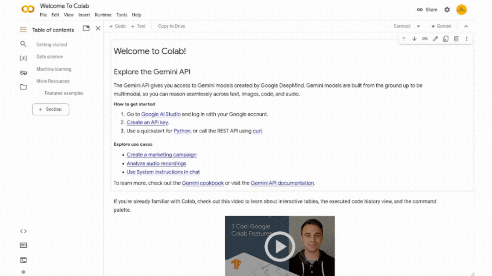

# Python 2024

Repositorio donde se encuentran los archivos de las clases de Python 2024.

## Clases

| Clase | Tema | Fecha |
| --- | --- | --- |
| [Clase 0](./Clase%200/Sintaxis%20basica%20y%20tipos%20de%20datos.ipynb) | Sintaxis básica y tipos de datos | 1 de Junio |
| [Clase 1](./Clase%201/Estructuras%20de%20Control.ipynb) | Operadores y control de flujo |  8 de Junio |

## Cómo abrir las clases en Google Colab

Abre Google Colab y copia el link `https://github.com/ACOIIN/Python-2024` y pégalo tal y como se muestra en el siguiente gif.

